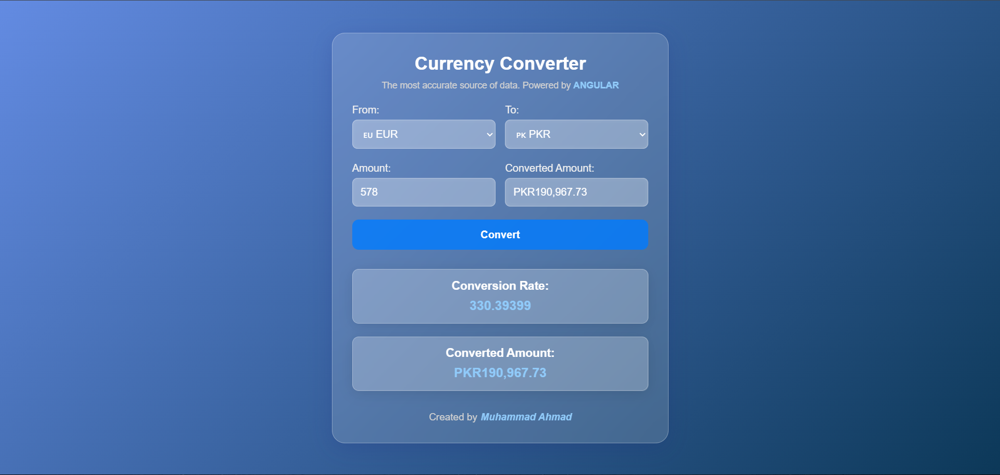

# 💱 Angular Currency Converter

A sleek and accurate currency converter built using **Angular 19**, **SCSS**, and a **service-driven architecture**. It uses live exchange rates powered by the [ExchangeRatesAPI.io](https://exchangeratesapi.io) to perform real-time conversions between popular currencies.

---

## 🌐 Live Demo

👉 [Click here to use the app](https://ahmad-889.github.io/currency-converter/)

---

## 🎯 What I Built

This application is structured into modular components with clean separation between UI and business logic. Here’s what I built:

* ✅ `CurrencyConverterComponent`: The core UI for selecting currencies and entering amounts  
* ✅ `CurrencyConverterService`: Fetches live exchange rates and performs conversion logic  
* ✅ Custom flag display for each currency using emoji and code  

All logic is separated cleanly, ensuring the app is easy to extend and maintain.

---

## 💡 Key Features

* Convert between major currencies like `USD`, `EUR`, `GBP`, `PKR`, `INR`, `JPY`
* Live exchange rates fetched from **ExchangeRatesAPI**
* Flag icons next to each currency in the dropdown
* Clean, responsive **glassmorphism** UI using SCSS
* Handles identical currency conversion gracefully
* Error-safe logic and fallback handling for missing API values

---

## 🧱 Technologies Used

* Angular 19 (Standalone Components)
* TypeScript
* SCSS
* RxJS + Angular HTTPClient
* REST API integration (ExchangeRatesAPI)
* Template-driven forms (`ngModel`)

---

## 📸 Screenshot



---

## 📁 Project Structure


```
src/
└── app/
├── components/
│ └── currency-converter/
│ ├── currency-converter.component.ts   # Component logic
│ ├── currency-converter.component.html # UI template
│ └── currency-converter.component.scss # Glassmorphism styling
└── services/
└── currency-converter.service.ts       # API + conversion logic
```

---


## ⚙️ API Used

**[ExchangeRatesAPI.io](https://exchangeratesapi.io)**  
Live exchange rates accessed via this endpoint:

---


## 🚀 Running the Project

Install Angular CLI if you haven't:

```bash
npm install -g @angular/cli
```

Install dependencies and serve:

```bash
npm install
ng serve
```

Visit `http://localhost:4200` to see the custom directives in action.

---

## 🔗 Author
Made with ❤️ by
Muhammad Ahmad
